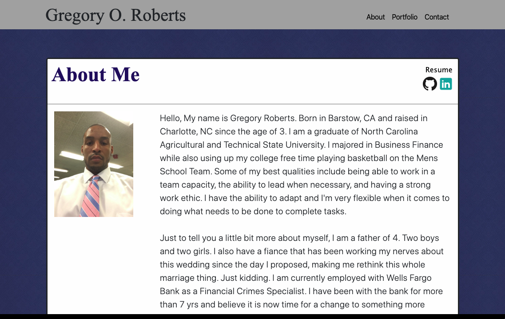
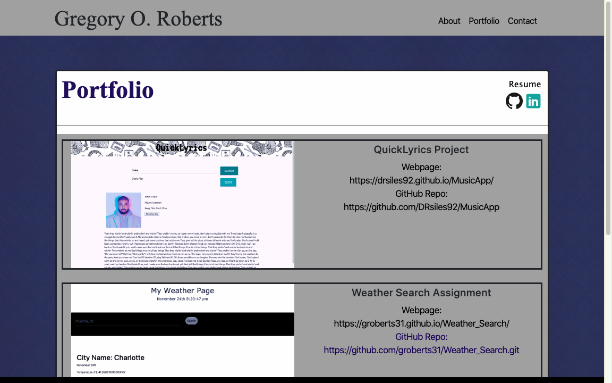
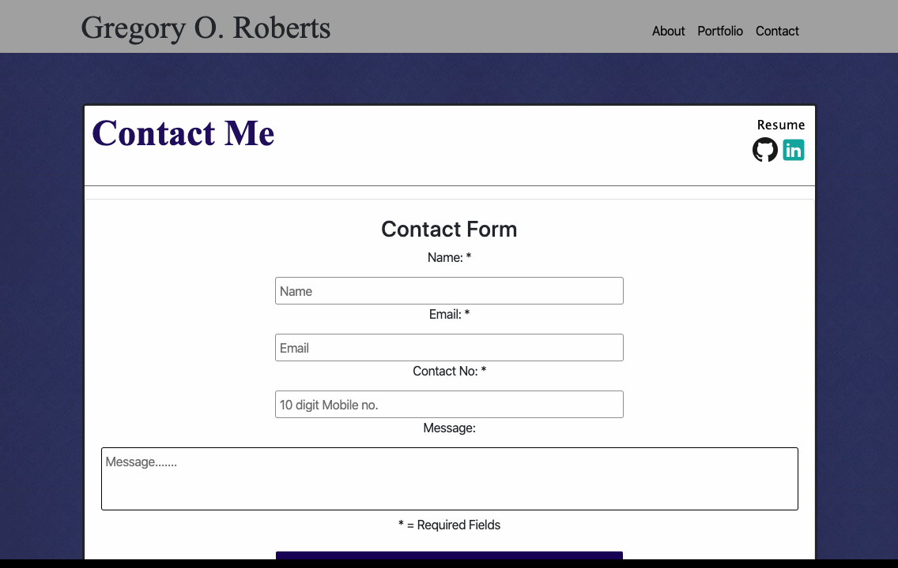

# UpdatedPortfolio
Updated Portfolio with actual info about me and styled better...

## Greg's Updated Portfolio 

In this repository you will find an updated portfolio for myself.

On the initial screen you will find a picture of myself along with a brief description about me as well.

In the top right corner of each page will be Navigation links to each page.

You will also find a link to a pdf version of my Resume with icons below of GitHub and LinkedIn which will take you to my profile page for either.

If you navigate to the Portfolio page you will find a list of projects I am quite proud of constructing and contributing to.

The Contact Page is there for anyone looking to get in contact with myself.

There will be a section for you to enter your name, email address, phone # and also a text area to leave a message if wanted.

Please be aware that you will need to at least have the required fields entered with info to submit your contact information.

